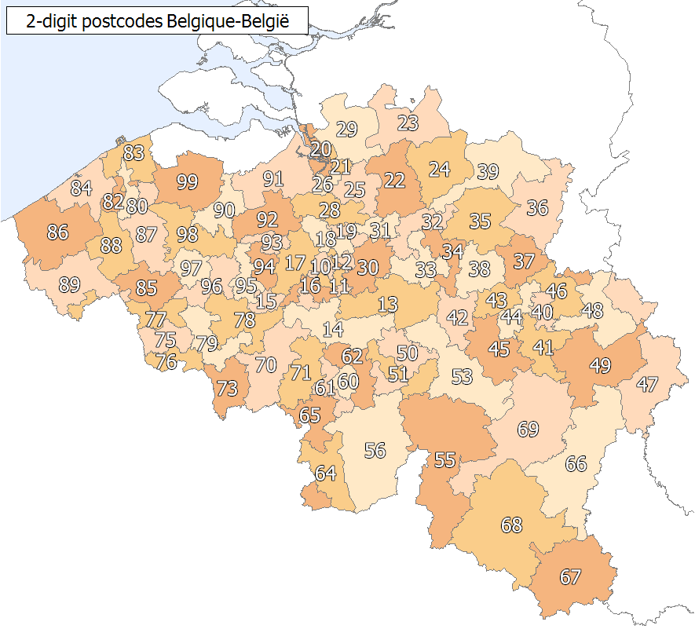

```{r setup, include=FALSE}
knitr::opts_chunk$set(echo = TRUE)
```

# Introduction

With the growth of available data and evolution of (cloud) computing, their is an increased interest to apply machine learning techniques to actuarial problems. This trend has been accelerated due to the Covid-19 crisis, see [@eiopa2019big] and [@eiopa2021XAI].

In this paper, we take a look at one way of introducing neural networks when working with a motor third party liability (hereinafter "MTPL") insurance, more specifically when modelling the claim count of an affiliate. We will see that naively training a neural network misses some of the key aspects of the data. When dealing with claim count data, most values are 0 since most policy holders do not report a claim during the year. However, the data is also skewed with fat tails. This makes it harder to train a neural network on the data, even after normalisation. 

The solution presented in this text comes from [@schelldorfer2019nesting]. The paper deals with Combined Actuarial Neural Networks (hereinafter "CANN"), which starts from a classical statistical model, like a generalised linear model (hereinafter "GLM"), and uses the neural network to uncover interaction effects and make adjustments to the predictions from the GLM.

Where [@schelldorfer2019nesting] makes mostly ad hoc choices, since the focus was more on showing the reader how to implement a CANN model, we go a step further and also do some basic hyperparameter tuning. 

We start with a small introduction of the dataset and show visually why we need to move from a neural network to a CANN model. After that, we start modelling a full CANN using the MTPL dataset for Belgium. The results of different models will be compared with each other in order to make some conclusions on this new technique. 

All neural network implementations are done using the `keras` library in `R`.

Please note that this is mostly a project done in the author's free time, so the code is not always optimised and some *best practices* may be absent. 

# A First Example
## The Data Set
Before starting to program, we need to load the necessary libraries and the MTPL dataset. 
```{r set_up, message=FALSE}
#### Setup ####

# Libraries needed
library(tidyverse)
library(readxl)
library(MASS)
library(readxl)
library(maidrr)
library(sp)
library(sf)
library(mapview)
library(mgcv)

library(keras)

# Import all data needed
mtpl_be <- maidrr::mtpl_be #the MTPL data set used here
postal_codes <- read_excel("../inspost.xls")

belgium_shape_sf <- st_read('../shape file Belgie postcodes/npc96_region_Project1.shp', quiet = TRUE)
belgium_shape_sf <- st_transform(belgium_shape_sf, CRS("+proj=longlat +datum=WGS84")) 
```

The dataset used is included in the `maidrr` package (see <https://github.com/henckr/maidrr>). It contains 163210 entries, each having 12 features (plus 1 column with an uninformative id). An important one is the $expo$ column, which represents the duration of the contract (exposure) during our observation period. Since not all contracts were in force for the whole observation year, it is important to incorporate this into our modelling. 

As an example suppose that we have two contracts where both policy holders reported one claim by the end of the year. The first one was in force over the whole year, but the second was only underwritten one month ago. There is clearly a difference in risk between the two, since we cannot say that one claim over a year and one claim over a month are the same. Hence, it will be crucial to use the exposure when modelling the number of claims for a given policy holder. 

A summary of the other features are given below. There is a mix of both numerical and categorical variables. The interesting reader can exploratory data analysis themselves. 
```{r str}
str(mtpl_be)
```
The only thing that we still mention is the fact that the postal code does not correspond to a specific municipality, but the postal code areas (first two digits of the four digit postal code), see the map below taken from <https://nl.wikipedia.org/wiki/Postnummers_in_Belgi%C3%AB>.

```{r, fig.width = 4, echo = FALSE}

```

## Modelling Claim Count Using Age
### A First Try
To illustrate the inherent flaw of a neural network when dealing with actuarial problems, we begin with a small model where the age of the policy holder is used to determine the risk, i.e., the expected number of claims^[This example is inspired by <https://katrienantonio.github.io/hands-on-machine-learning-R-module-3/sheets/ML_part3.html#94>]. Since we are dealing with claim counts, we assume that it follows a Poisson distribution. This distributional assumption is used to apply a generalised additive model (hereinafter "GAM") to model the expected number of claims via:
$$ \mathbb{E}(Y_i) = d_i\cdot\exp\left(\beta_0 + f_1(\text{age}_i)\right) $$
Note that we use the exponential function to insure positivity of the mean, and that we have also incorporated the exposure, denoted by $d_i$. The function $f_1$ is a *smoother*, which in our case is equal to a thin plate spline. A full understanding of this is not necessary to follow the rest of the text. 

The result of this GAM, which will be used as our base line model, is compared to the neural network. In the code, we incorporate the exposure as an offset, since we can rewrite the previous formula as follows:
$$ \mathbb{E}(Y_i) = \exp\left(\log(d_i)+\beta_0 + f_1(\text{age}_i)\right) $$
For the neural network, we use two hidden layers, each having 5 neurons. The activation function is the `tanh` in both cases. The exposure is added using a the `LogExpo` input node which has a non-trainable weight equal to 1 and does not use a bias term when connecting with the `layer_add` (exposure is fixed and should not be tampered with). As for the GAM, we use the exponential function as the final activation function when feeding into the output node, and this last connection is also non-trainable. The loss function is `poisson` since we assume a Poisson distribution.

```{r GAMage}
#GAM
GAM_age <- gam(nclaims ~ s(ageph), 
               data = mtpl_be, 
               offset = log(expo),
               family = poisson(link = "log"))

```

```{r NNage}
#NN
set.seed(1997)
Design <- layer_input(shape = c(1), dtype = "float32", name = "Design")
LogExpo <- layer_input(shape = c(1), dtype = "float32", name = "LogExpo")

Network <- Design %>%
  layer_batch_normalization(input_shape = c(1)) %>%
  layer_dense(units = 5, activation = 'tanh', name = 'hidden1') %>%
  layer_dense(units = 5, activation = 'tanh', name = 'hidden2') %>%
  layer_dense(units = 1, activation = 'linear', name = 'Network')

Response <- list(Network, LogExpo) %>%
  layer_add(name = 'Add') %>%
  layer_dense(units = 1, activation = k_exp, name = 'Response', trainable = FALSE,
              weights = list(array(1, dim=c(1,1)), array(0, dim = c(1))))

NN_age <- keras_model(inputs = c(Design, LogExpo), outputs = c(Response))

NN_age %>% compile(optimizer = optimizer_adam(), 
                    loss = "poisson")

Xfeat <- as.matrix(mtpl_be$ageph)
Xexpo <- as.matrix(log(mtpl_be$expo))
Ylearn <- as.matrix(mtpl_be$nclaims)

fit_nn_age <- NN_age %>% fit(list(Xfeat, Xexpo), Ylearn, 
                         epochs = 10, 
                         batch_size = 1718,
                         validation_split = 0.2, 
                         verbose = 0)

```

In order to compare the outcomes, we look at the predictions for every age. In addition, we also considered each age as an individual factor an fit a GLM (plotted in black). When looking at the plot below, we see that the GAM captured the trend in the data well (plotted in blue). We see a decrease of claim frequency for increasing ages. This decrease stabalises around 40 to 50 years old, most likely since the children of these people learn to drive with their parent's car, and cause more accidents. At older ages, we see that the number of accidents increases again. The GLM, with each age its own factor, fluctuates sustantially at the end. This is most likely cause by the fact that we have fewer observations for older ages.

The neural network (plotted in red), on the other hand, is able to point to the fact that claim frequency improves with age, but it may be too *simplistic*. The patterns throughout the ages is not captured.

Note that the plot shows the *yearly* average claim count predicted by the model, since we say that for each age we consider, the exposure is equal to 1 (year). We did not include the age of 18 in the plot, since the prediction for that factor in the GLM were very large. The underlying pattern for the other ages were not well visible due to the large scale needed on the y-axis. 

```{r plot_nn_gam_glm}
factor_age <- glm(nclaims ~ factor(ageph)-1, 
                  offset = log(expo), 
                  data = mtpl_be, 
                  family = poisson(link="log"))

XTest <- (min(mtpl_be$ageph)+1):max(mtpl_be$ageph)
ExpoTest <- rep(1, length(XTest)) #only yearly average claim count

y_fit_factor <- predict(factor_age, 
                        newdata = data.frame(ageph = XTest, expo = 1), 
                        type = "response")

y_fit_NN <- predict(NN_age, 
                    list(XTest, log(ExpoTest)))

y_fit_GAM <- predict(GAM_age, 
                     newdata = data.frame(ageph = XTest, expo = 1), 
                     type = "response")

Comparison <- tibble(Age = XTest, 
                     GAM = y_fit_GAM, 
                     NN = y_fit_NN, 
                     factors = y_fit_factor)

ggplot(Comparison, aes(x = Age)) +
  geom_line(aes(y= GAM), color = "blue") +
  geom_line(aes(y= NN), color = "red") +
  geom_line(aes(y= factors))+
  ylab("Response") +
  ggtitle("Difference between GAM and Neural Network")+
  theme_bw()

```

This clearly illustrates that a classic neural network may not be best suited to model these problems. In the above example, the network was rather small. It could be possible that a larger network with more hidden layers and nodes in each layer will better capture the patterns in the data. One need to keep in mind, however, that this is not practical. A very large model takes much more time to fit and is harder to maintain, and this does not weight against the marginal gains that can be made compared to the already satisfactory results coming from the GAM. A simpler model makes it also easier to implement and use in practice, and it has the advantage that one can more easily play with the parameters to express a certain business goal set up by the insurance company, e.g., special discounts for certain groups^[This point will not be solved by moving to CANN models. This is better done by using a smart way of dividing all explanatory variables into factor variables. These are then used to model a GLM, like we did, with each factor variable having its own coefficient. For more details, we refer to [@henckaerts2021boosting]]. 

### Moving to CANN's
In order to solve some of the shortcomings, one can move to the Combined Actuarial Neural Network setting, as represented in [@schelldorfer2019nesting]. The idea here is to use the predictions coming from the more classical statistical models, like the GLM and GAM, and use them as a guide for the your network. This way, the network itself does not model the Poisson distribution itself, but the smaller patterns in the data, not picked up by the statistical model. This is done by introducing a so-called (non-trainable) skip connection to the neural network, illustrated below (source: [@schelldorfer2019nesting]). 

```{r, out.width="40%", echo = FALSE}
knitr::include_graphics("Skip.png")
```

This skip connection needs to be cleverly integrated into our network. We still assume the exponential activation in the final step in the network (to insure positivity of the predicted mean). The output of a classic neural network would then look like this:
$$ \text{output} = \exp\left( \sum_i n_i w_i + b \right), $$
where $n_i$ are the inputs from the previous layer, $w_i$ the weights corresponding to the connections, and $b$ is the bias term. In a previous step, we have taken the exposure into account like this:
$$ \text{output} = \exp\left( \sum_i n_i w_i + b + \log(\text{expo}) \right). $$
The trick is now to use the skip connection as a first base prediction, and incorporate this into the output as well. We do this again by using the logarithm. We get the following:
$$ \text{output} = \exp\left( \sum_i n_i w_i + b + \log(\text{expo}) + \log(\text{base}) \right) = \text{expo}\cdot\text{base}\cdot\exp\left( \sum_i n_i w_i + b \right). $$
How to do this in `R` is illustrated below. We recycle the GAM from before to use as our base model. Note that we do **not** include `type = "response"` in the predict function. This way, we already have the logarithm of the predicted average claims. We also add the logarithm of the exposure, like in the equation above.
```{r CANN}
#CANN
set.seed(1997)
Vlearn2 <- as.matrix(predict(GAM_age) + log(mtpl_be$expo)) #You include exposure
LogGAM <- layer_input(shape = c(1),   dtype = 'float32', name = 'LogGAM')

Design2 <- layer_input(shape = c(1), dtype = "float32", name = "Design2")

Network2 <- Design2 %>%
  layer_batch_normalization() %>%
  layer_dense(units = 5, activation = 'tanh', name = 'hidden2_1') %>%
  layer_dense(units = 1, activation = 'linear', name = 'Network2')

Response2 <- list(Network2, LogGAM) %>%
  layer_add(name= "Add2") %>%
  layer_dense(units=1, activation="exponential", name = 'Response2', trainable=FALSE,
              weights=list(array(1, dim=c(1,1)), array(0, dim=c(1))))

CANN_age <- keras_model(inputs = c(Design2, LogGAM), 
                        outputs = c(Response2))

CANN_age %>% compile(optimizer = optimizer_rmsprop(), 
                     loss = "poisson")

CANN_age%>% fit(list("Design2" = Xfeat, "LogGAM"=Vlearn2), Ylearn, 
                                epochs = 25, 
                                batch_size = 1718, 
                                verbose = 0)
```

The plot from before then becomes:
```{r CANN_Base}
XTest <- (min(mtpl_be$ageph)+1):max(mtpl_be$ageph)
ExpoTest <- rep(1, length(XTest))

y_fit_factor <- predict(factor_age, newdata = data.frame(ageph = XTest, expo = 1), 
                        type = "response")

y_fit_GAM <- predict(GAM_age, newdata = data.frame(ageph = XTest, expo = 1), 
                     type = "response")

y_fit_CANN <- predict(CANN_age, list(XTest, 
                                     predict(GAM_age, 
                                                    newdata = data.frame(ageph = XTest, expo = 1))))

Comparison <- tibble(Age = XTest, 
                     GAM = y_fit_GAM, 
                     CANN = y_fit_CANN, 
                     factors = y_fit_factor)

ggplot(Comparison, aes(x = Age)) +
  geom_line(aes(y= GAM), color = "blue") +
  geom_line(aes(y= CANN), color = "darkgreen")+
  geom_line(aes(y= factors))+
  ylab("Response") +
  ggtitle("Difference between GAM and CANN")+
  theme_bw()

```

It may not be highly visible here, but the CANN has made some correction to the GAM. Here, we see that this is rather small. The true power will become clear later in this document, when we model the claim count with all variables. Using a neural network like this will allow us to incorporate interactions between the different variables that are not captured by the GAM. This makes it also much easier to incorporate these interactions. You can define interactions when fitting the GAM, but then you need to specify each one explicitly, which can take a lot of trial and error to incorporate the right ones, and only the right ones. In addition, the neural network captures interactions that may not be of a multiplicative nature, which is much harder to do with a GAM or GLM. Let's see all this in practice in the next section. 

# Modelling the Full Dataset
## Some theory
In this part, we cover some basic concepts needed to build and evaluate the different models. 

To start, we need to define some *loss function* to evaluate the performance of the model. Since we are dealing with count data, we want to take the characteristics of the distribution into account. In this paper, we always assume a Poisson distribution, hence we are going to use the Poisson deviance as our loss function. This is defined as follows: 
$$ D^\text{Poisson}(\boldsymbol{y}, f_\text{predict}(\boldsymbol{x})) = \frac{2}{n}\sum_{i=1}^N \left( y_i \cdot \ln\left(\frac{y_i}{f_\text{predict}(x_i)}  \right) - \left(y_i-f_\text{predict}(x_i)\right) \right). $$
This Poisson deviance expresses how much the model deviates from a model that just reproduces the data, i.e., you take the observed number of claims as the average number of claims for each policy holder. In the code below, we use 200 instead of 2 to better see the slight difference in deviance after the decimal point, since the differences can be minor. 

```{r poisdev}
Poisson.Deviance <- function(pred, obs){200*(sum(pred)-sum(obs)+sum(log((obs/pred)^(obs))))/length(pred)}
```

In order to better grasp the performance of the model on unseen data, we do a train test split. This way, we avoid selected a model that seems the best, but is just over fitting, and therefore is inferior to use on new data, and hence to underwrite new policies. 

Since the data is inherently skewed, we know there will be some extreme values. As we do not want these extreme values to be concentrated in either the train or test set, we apply a stratified way of doing this split. This insures that the distribution of claims is more or less the same in both the train and test set. We then implicitly assume that the distribution of future claims (train) will be similar to the past (test). In this paper, we explain it more generally, since this is how the code is built up. What is represented here can actually be used for stratified k-fold cross validation with only minor adaptations of the code. 

The procedure consists of three main steps. 
Firstly, we order all outcomes from largest to smallest according to the feature you are interested in. 
$$ Y_{(1)}, Y_{(2)}, \ldots, Y_{(N)} $$
Next, we construct $l =\lceil N/k \rceil$ different urns $\mathcal{U}_i$, where $\mathcal{U}_1$ contains the $k$ largest observations, $\mathcal{U}_2$ the next $k$ largest and so on. 

Finally, the $k$ folds are constructed as 
$$ \mathcal{D}_k = \left\{\text{pick randomly without replacement one case from each urn } \mathcal{U}_1, \ldots, \mathcal{U}_{\lceil N/k \rceil} \right\}. $$
In our case, we take the training data to be $80\%$ of our full dataset. This is done by setting $k=10$, and recombining $\mathcal{D}_1,\ldots,\mathcal{D}_8$ into the training set and the last two folds into the test set. We only order on the number of claims reported, but it is possible to also take the exposure into account, or any other feature for that matter.

The way it is implemented here, takes a long time to run. We advise the reader to look into more optimised ways of doing this. Nonetheless, the full code is available to use on <https://github.com/B-Deprez/CANN-Models/blob/main/stratify_train_test.R>.

```{r stratTrainTest, eval = FALSE}
stratify_train_test <- function(df_input, cov, p=0.8, k = 10){
  #Set k and p to have a round amount of bins
  df_to_split <- df_input %>%
    dplyr::arrange(desc(df_input[cov]))
  l = ceiling(nrow(df_to_split)/k)
  for(i in 1:l){
    selected_rows <- df_to_split[((i-1)*k+1):min((i*k),nrow(df_to_split)),]
    permutation <- sample(min(k, nrow(df_to_split)-(i-1)*k))
    if(i == 1){ #First time through loop => initialise 
      df_strat_train<- selected_rows[permutation[1:(k*p)],]
      df_strat_test <- selected_rows[permutation[(k*p+1):length(permutation)],]
    }else if((k*p+1)<=length(permutation)){ 
      df_strat_train <- rbind(df_strat_train, selected_rows[permutation[1:(k*p)],])
      df_strat_test <- rbind(df_strat_test, selected_rows[permutation[(k*p+1):length(permutation)],])
    }else{ #If not enough observations in the end => put all in training set
      df_strat_train <- rbind(df_strat_train, selected_rows)
    }
  }
  return(list(df_strat_train, df_strat_test))
}

stratified_train_test_split <- stratify_train_test(mtpl_be, c("nclaims"))
mtpl_train <- stratified_train_test_split[[1]]
mtpl_test <- stratified_train_test_split[[2]]

```

The final piece of theory we need, concerns embedding layers for the categorical features. This is in contrast to a more brute force way of using one-hot encoding. When using one-hot encoding for features that have many levels (like the postal codes in our dataset), one creates a lot of extra features that need to be incorporated in the network. This results in a large sparse matrix. 

Better results can be obtained by using embedding layers. These represent the factors by numerical coordinates in a low dimensional space. The two main advantages are that (1) the dimension is reduced and (2) similarities between factor levels can be examined. Where the Euclidean distance is always $\sqrt{2}$ between different levels when using one-hot encoding, the similarity between factors is represented by a smaller distance when using an embedding. 

We take the example from [@schelldorfer2019nesting]. Below, one can clearly see that, after embedding, car brand B1 and B3 are very similar, while brand B12 is very dissimilar from all the rest. This will come in handy in for our dataset, where we want to capture similarities in claim frequency amongst the different postal regions (cities, rural areas etc.). 

```{r, out.width="40%", echo = FALSE}
knitr::include_graphics("Embed.png")
```

We now have all the tools to dive into the full modelling of the claim counts in our dataset. 

## The Full Modelling Part
We begin by reconsidering at the structure of our data. This will give us more insights in what to include doing the modelling. 

```{r structure_again}
str(mtpl_be)
```

As a nice example, we consider a first visual check of the claim distribution in Belgium. Note that we have used a shapefile of Belgium where all postal codes are present. We first need to do some manipulation in order to only have the postal code regions. For this, we regroup all communities by the first two digits of their postal code. Once that is done, we rescale the average claim frequency by dividing by the area of the postal region. This is to reflect the population density, in a way. One claim in on a small area (say a street) is different than one claim over a large (maybe rural) area. 

To make it more visual, we divide everything into five different risk classes according to their quantiles. We note that the shapefile is a bit outdated, so we needed to downgrade the `sf` library to version 0.9-6 in order for everything to work properly. The reader is encouraged to look for a more recent shapefile. 

```{r shape}
post_claim <- mtpl_be %>% group_by(postcode) %>% summarize(num = n(), 
                                                            mean_claim = mean(nclaims))
belgium_shape_sf_grouped <- belgium_shape_sf %>% 
  mutate(codpos = as.factor(floor(POSTCODE/100))) %>%
  group_by(codpos) %>%
  summarise(geometry = st_union(geometry),
            Shape_Area = sum(Shape_Area)) %>%
  left_join(post_claim, 
            by = c("codpos" = "postcode"))

belgium_shape_sf_grouped$freq <- 
  belgium_shape_sf_grouped$mean_claim/belgium_shape_sf_grouped$Shape_Area
belgium_shape_sf_grouped$freq_class <- cut(belgium_shape_sf_grouped$freq, 
                                   breaks = quantile(belgium_shape_sf_grouped$freq, 
                                                     c(0,0.20, 0.4,0.6,0.8,1), 
                                                     na.rm = TRUE),
                                   right = FALSE, include.lowest = TRUE, 
                                   labels = c("low", "average-low", "average", 
                                              "average-high", "high"))
map_freq <- ggplot(belgium_shape_sf_grouped) +
  geom_sf(aes(fill = freq_class), size = 0) +
  ggtitle("Claim frequency data") +
  scale_fill_brewer(palette = "Blues", na.value = "white") + 
  labs(fill = "Relative\nclaim fequency") +
  theme_bw();map_freq

```

We can clearly see that most claims are reported in more urbanised areas (Bruges, Ghent, Antwerp, Brussels, Liège), where there is more traffic, while very few claims are reported in less densely populated areas (the Ardennes, the Kempen, and the region around Diksmuide).

Finally, we move to the modelling part. We begin by fitting a GAM model, which will be used as our base-line model. We visualise the smoothers and calculate the Poisson deviance for this model. Note that the age smoother is similar to the one whe had before. 

```{r load_data, include=FALSE}
load("../.RData")
```

```{r full_GAM, eval=FALSE}
## GAM
GAM_full <- gam(nclaims ~ coverage + s(ageph) + sex + s(bm) + s(power) + 
                  s(agec) + fuel + use + fleet + postcode, 
                data = mtpl_train, 
                offset = log(expo), 
                family = poisson(link = "log"))

par(mfrow = c(2,2))
plot(GAM_full, scale = 0)
```

```{r GAMRES}
# Results from the GAM are our benchmark
y_test_fullGAM <- GAM_full %>% predict(newdata = mtpl_test, type = "response")
Poisson.Deviance(y_test_fullGAM, mtpl_test$nclaims)
```

Hence, the reference Poisson deviance is equal to `r Poisson.Deviance(y_test_fullGAM, mtpl_test$nclaims)`.

Next, we do some parameter tuning when building our CANN model. We consider both a one and two dimensional embedding for the postal code regions. We also consider neural networks with either 1 or 3 hidden layers. These hidden layers can either have 5, 10 or 15 neurons.  For the one with one hidden layer, we also tune the activation function, something we don't do for the three hidden layers, since this would have taken too long for this small paper. 

Note that we initialise most of the layers every time we consider a new set of hyperparameters. This is done to make sure that the fitting of the model does not start in the *optimal* point of the previous optimisation. 

```{r tune_1, eval = FALSE}
## CANN
# We use embeddings for the factor varaibles
non_cat <- c(5, 7:9)
n0 <- length(non_cat)

Xlearn <- as.matrix(mtpl_train[,non_cat])
Vlearn <- as.matrix(predict(GAM_full) + log(mtpl_train$expo))

CovLearn <- as.matrix(as.integer(mtpl_train$coverage))-1
NCov <- length(unique(CovLearn))
SexLearn <- as.matrix(as.integer(mtpl_train$sex))-1
NSex <- length(unique(SexLearn))
FuelLearn <- as.matrix(as.integer(mtpl_train$fuel))-1
NFuel <- length(unique(FuelLearn))
UseLearn <- as.matrix(as.integer(mtpl_train$use))-1
NUse <- length(unique(UseLearn))
FleetLearn <- as.matrix(as.integer(mtpl_train$fleet))-1
NFleet <- length(unique(FleetLearn))
PcLearn <- as.matrix(as.integer(mtpl_train$postcode))-1
NPc <- length(unique(PcLearn))

XTest <- as.matrix(mtpl_test[,non_cat])
VTest <- as.matrix(predict(GAM_full, newdata = mtpl_test) + log(mtpl_test$expo))

CovTest <- as.matrix(as.integer(mtpl_test$coverage))-1
SexTest <- as.matrix(as.integer(mtpl_test$sex))-1
FuelTest <- as.matrix(as.integer(mtpl_test$fuel))-1
UseTest <- as.matrix(as.integer(mtpl_test$use))-1
FleetTest <- as.matrix(as.integer(mtpl_test$fleet))-1
PcTest <- as.matrix(as.integer(mtpl_test$postcode))-1

Ylearn <- as.matrix(mtpl_train$nclaims)

Design <- layer_input(shape = c(n0), dtype = 'float32', name = 'Design')

LogGAM <- layer_input(shape = c(1),   dtype = 'float32', name = 'LogGAM')

Coverage <- layer_input(shape = c(1), dtype = 'int32', name = 'Coverage')
Sex <- layer_input(shape = c(1), dtype = 'int32', name = 'Sex')
Fuel <- layer_input(shape = c(1), dtype = 'int32', name = 'Fuel')
Usage <- layer_input(shape = c(1), dtype = 'int32', name = 'Usage')
Fleet <- layer_input(shape = c(1), dtype = 'int32', name = 'Fleet')
PostalCode <- layer_input(shape = c(1), dtype = 'int32', name = 'PostalCode')

num_layers <- c(1,3)
num_neurons <- c(5,10,15)
activ <- c("relu", "tanh")

grid_nn <- expand_grid(num_neurons, activ)

## With 1 layer

Tune_1 <- tibble(emb_dim = integer(), 
                 l_1 = integer(), 
                 pois_dev = numeric())

for(i in 1:2){ #Embedding dimensions
  # We repeat all layers, so they are initialised, and training doesn't start
  # in the optimal position of previous one
  CovEmb = Coverage %>%
    layer_embedding(input_dim = NCov, output_dim = 2, input_length = 1, name = "CovEmb") %>%
    layer_flatten(name = "Cov_flat") 
  
  SexEmb = Sex %>%
    layer_embedding(input_dim = NSex, output_dim = 1, input_length = 1, name = "SexEmb") %>%
    layer_flatten(name = "Sex_flat") 
  
  FuelEmb = Fuel %>%
    layer_embedding(input_dim = NFuel, output_dim = 1, input_length = 1, name = "FuelEmb") %>%
    layer_flatten(name = "Fuel_flat") 
  
  UsageEmb = Usage %>%
    layer_embedding(input_dim = NUse, output_dim = 1, input_length = 1, name = "UsageEmb") %>%
    layer_flatten(name = "Usage_flat") 
  
  FleetEmb = Fleet %>%
    layer_embedding(input_dim = NFleet, output_dim = 1, input_length = 1, name = "FleetEmb") %>%
    layer_flatten(name = "Fleet_flat") 
  
  PcEmb = PostalCode %>%
    layer_embedding(input_dim = NPc, output_dim = i, input_length = 1, name = "PcEmb") %>%
    layer_flatten(name = "Pc_flat") 
  
  for(l_1 in 1:(dim(grid_nn)[1])){
    Network <- list(Design, CovEmb, SexEmb, FuelEmb, UsageEmb, FleetEmb, PcEmb) %>%
      layer_concatenate(name = 'concate') %>%
      layer_batch_normalization() %>%
      layer_dense(units=as.numeric(grid_nn[l_1, 1]), 
                  activation=as.character(grid_nn[l_1,2]), 
                  name='hidden1')%>%
      layer_dense(units=1, activation='linear', name='Network')
    
    Response <- list(Network, LogGAM) %>% layer_add(name='Add') %>% 
      layer_dense(units=1, activation=k_exp, name = 'Response', trainable=FALSE,
                  weights=list(array(1, dim=c(1,1)), array(0, dim=c(1))))
    
    model_tune <- keras_model(inputs = c(Design, Coverage, Sex, Fuel, Usage, Fleet, PostalCode, LogGAM),
                         outputs = c(Response))
    
    model_tune %>% compile(optimizer = optimizer_nadam(), loss = 'poisson')
    
    fit_tune <- model_tune %>% fit(list(Xlearn, CovLearn, SexLearn, FuelLearn, UseLearn, FleetLearn, PcLearn, Vlearn),
                    Ylearn, 
                    epochs = 20, 
                    batch_size = 1718, 
                    verbose = 0)
    
    y_test <- model_tune %>% predict(list(XTest, CovTest, SexTest, FuelTest, UseTest, FleetTest, PcTest, VTest))
    pois_dev <- Poisson.Deviance(y_test, mtpl_test$nclaims)
    print(pois_dev)
    Tune_1 <- Tune_1 %>% add_row(emb_dim = i, l_1 = l_1,pois_dev =pois_dev)
  }
}
```

```{r result1}
Result1 <- Tune_1 %>% 
  filter(pois_dev == min(pois_dev)) %>%
  mutate(number_neurons = as.numeric(grid_nn[l_1, 1]),
         activation = as.character(grid_nn[l_1, 2])); Result1
```

```{r tune3, eval = FALSE}
# 3 hidden layers
Tune_3 <- tibble(emb_dim = integer(), 
                 l_1 = integer(), 
                 l_2 = integer(), 
                 l_3 = integer(), 
                 pois_dev = numeric())

for(i in 1:2){ #Embedding dimensions
  # We repeat all layers, so they are initialised, and training doesn't start
  # in the optimal position of previous one
  CovEmb = Coverage %>%
    layer_embedding(input_dim = NCov, output_dim = 2, input_length = 1, name = "CovEmb") %>%
    layer_flatten(name = "Cov_flat") 
  
  SexEmb = Sex %>%
    layer_embedding(input_dim = NSex, output_dim = 1, input_length = 1, name = "SexEmb") %>%
    layer_flatten(name = "Sex_flat") 
  
  FuelEmb = Fuel %>%
    layer_embedding(input_dim = NFuel, output_dim = 1, input_length = 1, name = "FuelEmb") %>%
    layer_flatten(name = "Fuel_flat") 
  
  UsageEmb = Usage %>%
    layer_embedding(input_dim = NUse, output_dim = 1, input_length = 1, name = "UsageEmb") %>%
    layer_flatten(name = "Usage_flat") 
  
  FleetEmb = Fleet %>%
    layer_embedding(input_dim = NFleet, output_dim = 1, input_length = 1, name = "FleetEmb") %>%
    layer_flatten(name = "Fleet_flat") 
  
  PcEmb = PostalCode %>%
    layer_embedding(input_dim = NPc, output_dim = i, input_length = 1, name = "PcEmb") %>%
    layer_flatten(name = "Pc_flat") 
  
  for(l_1 in 1:(length(num_neurons))){
    for(l_2 in 1:(length(num_neurons))){
      for(l_3 in 1:(length(num_neurons))){
        Network <- list(Design, CovEmb, SexEmb, FuelEmb, UsageEmb, FleetEmb, PcEmb) %>%
          layer_concatenate(name = 'concate') %>%
          layer_batch_normalization() %>%
          layer_dense(units=as.numeric(num_neurons[l_1]), 
                      activation="tanh", 
                      name='hidden1')%>%
          layer_dense(units=as.numeric(num_neurons[l_2]), 
                      activation="tanh", 
                      name='hidden2')%>%
          layer_dense(units=as.numeric(num_neurons[l_3]), 
                      activation="tanh", 
                      name='hidden3')%>%
          layer_dense(units=1, activation='linear', name='Network')
        
        Response <- list(Network, LogGAM) %>% layer_add(name='Add') %>% 
          layer_dense(units=1, activation=k_exp, name = 'Response', trainable=FALSE,
                      weights=list(array(1, dim=c(1,1)), array(0, dim=c(1))))
        
        model_tune <- keras_model(inputs = c(Design, Coverage, Sex, Fuel, Usage, Fleet, PostalCode, LogGAM),
                                  outputs = c(Response))
        
        model_tune %>% compile(optimizer = optimizer_nadam(), loss = 'poisson')
        
        fit_tune <- model_tune %>% fit(list(Xlearn, CovLearn, SexLearn, FuelLearn, UseLearn, FleetLearn, PcLearn, Vlearn),
                                       Ylearn, 
                                       epochs = 20, 
                                       batch_size = 1718, 
                                       verbose = 0)
        
        y_test <- model_tune %>% predict(list(XTest, CovTest, SexTest, FuelTest, UseTest, FleetTest, PcTest, VTest))
        pois_dev <- Poisson.Deviance(y_test, mtpl_test$nclaims)
        print(pois_dev)
        Tune_3 <- Tune_3 %>% add_row(emb_dim = i, 
                                     l_1 = l_1,
                                     l_2 = l_2, 
                                     l_3 = l_3, 
                                     pois_dev = pois_dev)
      }
    }
  }
}
```

```{r result3}
Result3 <- Tune_3 %>% 
  filter(pois_dev == min(pois_dev)) %>%
  mutate(number_neurons1 = as.numeric(num_neurons[l_1]),
         number_neurons2 = as.numeric(num_neurons[l_2]),
         number_neurons3 = as.numeric(num_neurons[l_3])); Result3
```

Now, we also compare the best of both tuning procedures and find the following: 
```{r compare1_3}
Result1$pois_dev
Result3$pois_dev
```

We see that the model with three hidden layers does slightly better. 

As a final comparison, we look at the total number of predicted claims over the whole dataset. We will first refit the models using the optimal values of the hyperparameters. 
```{r total}
#### Total number of claims predicted ####
#First retrain the models with the resulting hyperparameters
set.seed(1997)

## One layer network
CovEmb = Coverage %>%
  layer_embedding(input_dim = NCov, output_dim = 2, input_length = 1, name = "CovEmb") %>%
  layer_flatten(name = "Cov_flat") 

SexEmb = Sex %>%
  layer_embedding(input_dim = NSex, output_dim = 1, input_length = 1, name = "SexEmb") %>%
  layer_flatten(name = "Sex_flat") 

FuelEmb = Fuel %>%
  layer_embedding(input_dim = NFuel, output_dim = 1, input_length = 1, name = "FuelEmb") %>%
  layer_flatten(name = "Fuel_flat") 

UsageEmb = Usage %>%
  layer_embedding(input_dim = NUse, output_dim = 1, input_length = 1, name = "UsageEmb") %>%
  layer_flatten(name = "Usage_flat") 

FleetEmb = Fleet %>%
  layer_embedding(input_dim = NFleet, output_dim = 1, input_length = 1, name = "FleetEmb") %>%
  layer_flatten(name = "Fleet_flat") 

PcEmb = PostalCode %>%
  layer_embedding(input_dim = NPc, output_dim = 1, input_length = 1, name = "PcEmb") %>%
  layer_flatten(name = "Pc_flat") 

Network <- list(Design, CovEmb, SexEmb, FuelEmb, UsageEmb, FleetEmb, PcEmb) %>%
  layer_concatenate(name = 'concate') %>%
  layer_batch_normalization() %>%
  layer_dense(units=15, 
              activation="tanh", 
              name='hidden1')%>%
  layer_dense(units=1, activation='linear', name='Network')

Response <- list(Network, LogGAM) %>% layer_add(name='Add') %>% 
  layer_dense(units=1, activation=k_exp, name = 'Response', trainable=FALSE,
              weights=list(array(1, dim=c(1,1)), array(0, dim=c(1))))

model_1 <- keras_model(inputs = c(Design, Coverage, Sex, Fuel, Usage, Fleet, PostalCode, LogGAM),
                          outputs = c(Response))

model_1 %>% compile(optimizer = optimizer_nadam(), loss = 'poisson')

fit_1 <- model_1 %>% fit(list(Xlearn, CovLearn, SexLearn, FuelLearn, UseLearn, FleetLearn, PcLearn, Vlearn),
                               Ylearn, 
                               epochs = 20, 
                               batch_size = 1718)

y_pred_1 <- model_1 %>% predict(list(XTest, CovTest, SexTest, FuelTest, UseTest, FleetTest, PcTest, VTest))
Poisson.Deviance(y_pred_1, mtpl_test$nclaims)

#Three layer network
Network <- list(Design, CovEmb, SexEmb, FuelEmb, UsageEmb, FleetEmb, PcEmb) %>%
  layer_concatenate(name = 'concate') %>%
  layer_batch_normalization() %>%
  layer_dense(units=5, 
              activation="tanh", 
              name='hidden1')%>%
  layer_dense(units=15, 
              activation="tanh", 
              name='hidden2')%>%
  layer_dense(units=5, 
              activation="tanh", 
              name='hidden3')%>%
  layer_dense(units=1, activation='linear', name='Network')

Response <- list(Network, LogGAM) %>% layer_add(name='Add') %>% 
  layer_dense(units=1, activation=k_exp, name = 'Response', trainable=FALSE,
              weights=list(array(1, dim=c(1,1)), array(0, dim=c(1))))

model_3 <- keras_model(inputs = c(Design, Coverage, Sex, Fuel, Usage, Fleet, PostalCode, LogGAM),
                          outputs = c(Response))

model_3 %>% compile(optimizer = optimizer_nadam(), loss = 'poisson')

fit_3 <- model_3 %>% fit(list(Xlearn, CovLearn, SexLearn, FuelLearn, UseLearn, FleetLearn, PcLearn, Vlearn),
                               Ylearn, 
                               epochs = 20, 
                               batch_size = 1718)

y_pred_3 <- model_3 %>% predict(list(XTest, CovTest, SexTest, FuelTest, UseTest, FleetTest, PcTest, VTest))
Poisson.Deviance(y_pred_3, mtpl_test$nclaims)

# Total claims predicted
Total_claims <- sum(mtpl_test$nclaims)

Total_GAM <- sum(GAM_full %>% 
  predict(newdata= mtpl_test, type = "response"))

Total_1 <- sum(y_pred_1)

Total_3 <- sum(y_pred_3)

tibble(Total_claims, Total_GAM, Total_1, Total_3)

```

We see that the CANN's give a better picture of the total number of expected claims in the portfolio. 

# Conclusion
In this paper, we have looked a one way of including neural networks into actuarial problems. First, we saw why special care needs to be taken when doing this. We presented how Combined Actuarial Neural Networks can be implemented, and illustrated the results one a Belgian motor third party liability insurance. We saw that we got superior results compared to more classical, statistical techniques like the GAM. 

# References
